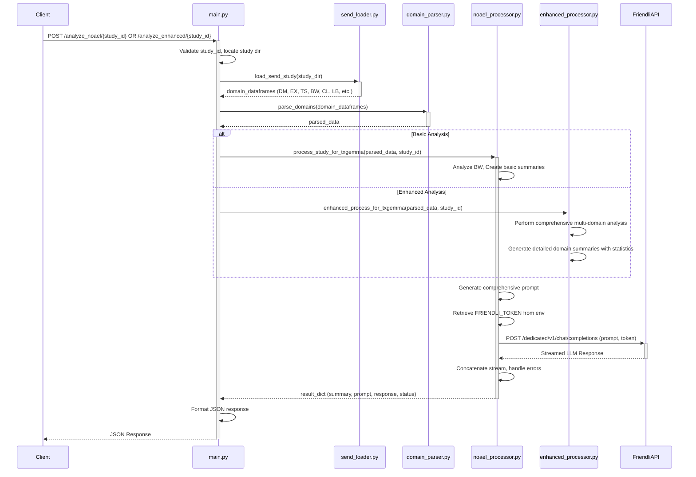

# Architecture: SEND NOAEL Analysis API (LLM Demo)

## 1. Overview

This document describes the architecture of the refocused SEND NOAEL Analysis API. The primary goal is to provide a streamlined backend service demonstrating the use of a Large Language Model (LLM), such as TxGemma (or compatible Gemini models), to analyze summarized findings from SEND studies and assist in NOAEL assessment.

This version intentionally removes the complexities of a traditional ML prediction pipeline and a dedicated frontend UI to focus on the core LLM interaction workflow.

## 2. Core Components

The system consists of the following main Python components:

1.  **FastAPI Application (`src/api/main.py`):**
    *   Provides the main REST API interface.
    *   Handles incoming HTTP requests.
    *   Defines endpoints for study upload (`/upload/`), basic analysis (`/analyze_noael/{study_id}`), and enhanced analysis (`/analyze_enhanced/{study_id}`).
    *   Orchestrates the overall workflow by calling data loading, parsing, and processing modules.
    *   Manages basic configuration (logging, environment variable loading via `python-dotenv`).

2.  **Data Loading (`src/data_processing/send_loader.py`):**
    *   Responsible for locating and reading SEND dataset files (`.xpt`) from a specified study directory.
    *   Uses the `pyreadstat` library to parse `.xpt` files into pandas DataFrames.
    *   Handles basic error checking during file loading.

3.  **Domain Parsing (`src/data_processing/domain_parser.py`):**
    *   Takes raw domain DataFrames (from `send_loader`) as input.
    *   Performs initial cleaning, validation, and extracts key information relevant to the downstream analysis (e.g., standardizing column names, basic type conversions).
    *   Currently focuses on domains needed for the target analysis (DM, EX, TS, BW).

4.  **Basic NOAEL Processor (`src/processing/noael_processor.py`):**
    *   **Original module focusing primarily on Body Weight analysis.**
    *   Receives parsed domain data (DM, EX, TS, BW, and other domains if available).
    *   **Analysis:** Implements basic analysis strategy focusing on Body Weight changes.
    *   **Summarization:** Creates a summary of Body Weight data with some basic summaries from other domains if available.
    *   **Prompt Generation:** Constructs a structured natural language prompt including study metadata and findings.
    *   **LLM Interaction:** 
        *   Retrieves Friendli API token (`FRIENDLI_TOKEN`) from environment variables.
        *   Uses the `requests` library to make a POST request to the Friendli API endpoint.
        *   Handles the streamed response from the LLM, including potential errors.
    *   Can handle missing BW domain data with graceful fallbacks.
    *   Returns the analysis results, the prompt sent, and the LLM response.

5.  **Enhanced NOAEL Processor (`src/processing/enhanced_processor.py`):**
    *   **Advanced module for comprehensive multi-domain analysis.**
    *   Performs detailed analysis across all available domains (DM, EX, TS, BW, CL, LB, MA, MI, OM, CV, EG).
    *   **Enhanced Analysis:** Provides statistical comparisons against controls, dose-response relationships, and detailed incidence rates.
    *   **Structured Summarization:** Generates detailed summaries for each domain with tables and statistical comparisons.
    *   **Advanced Prompt Templates:** Uses more sophisticated prompts based on the available domain data.
    *   **Robust Error Handling:** Gracefully handles missing domains and different study types.
    *   Implements the same LLM interaction pattern as the basic processor.

6.  **Configuration (`.env` file):**
    *   Stores sensitive information like the Friendli API token (`FRIENDLI_TOKEN`).
    *   Note: The target LLM model ID and Friendli API URL are currently hardcoded in `src/processing/noael_processor.py`.
    *   Loaded at application startup using `python-dotenv`.

## 3. Data Flow (Analyze Endpoint)

## 4. Key Technologies

*   **Python:** Core programming language.
*   **FastAPI:** Web framework for building the API.
*   **Uvicorn:** ASGI server to run the FastAPI application.
*   **Pandas:** Data manipulation and analysis (for handling SEND domain data).
*   **Pyreadstat:** Reading SAS `.xpt` files.
*   **requests:** Used for making HTTP calls to the Friendli API.
*   **python-dotenv:** Loading environment variables for configuration.
*   **uv:** Package and environment management.

## 5. Simplifications from Previous Architecture

*   **No Frontend:** The dedicated Next.js frontend has been removed.
*   **No Traditional ML Model:** The XGBoost model, associated feature extraction (`feature_extractor.py`), model loading (`ml_predictor.py`), and placeholder model generation have been removed.
*   **No Complex Numerical Features:** The focus shifts from generating a large vector of numerical features to generating a textual summary for the LLM.
*   **Focused API:** The API endpoints are streamlined to upload and two analysis options (basic and enhanced).
*   **Consolidated Logic:** The analysis logic resides in the `processing` module, with specialized processors for different analysis approaches. 
*   **Adaptive Prompting:** The system now adapts to available domains with more sophisticated prompt strategies.